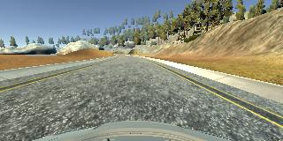

# **Behavioral Cloning**

---

**Behavioral Cloning Project**

The goals / steps of this project are the following:
* Use the simulator to collect data of good driving behavior
* Build, a convolution neural network in Keras that predicts steering angles from images
* Train and validate the model with a training and validation set
* Test that the model successfully drives around track one without leaving the road
* Summarize the results with a written report


[//]: # (Image References)

[image1]: ./examples/placeholder.png "Model Visualization"
[image2]: ./examples/placeholder.png "Grayscaling"
[image3]: ./examples/placeholder_small.png "Recovery Image"
[image4]: ./examples/placeholder_small.png "Recovery Image"
[image5]: ./examples/placeholder_small.png "Recovery Image"
[image6]: ./examples/placeholder_small.png "Normal Image"
[image7]: ./examples/placeholder_small.png "Flipped Image"

---
### Files Submitted & Code Quality

#### 1. Submission includes all required files and can be used to run the simulator in autonomous mode

My project includes the following files:
* model.py containing the script to create and train the model
* drive.py for driving the car in autonomous mode
* model.h5 containing a trained convolution neural network
* writeup_report.md or writeup_report.pdf summarizing the results

#### 2. Submission includes functional code
Using the Udacity provided simulator and my drive.py file, the car can be driven autonomously around the track by executing
```sh
python drive.py model.h5
```

#### 3. Submission code is usable and readable

The model.py file contains the code for training and saving the convolution neural network. The file shows the pipeline I used for training and validating the model, and it contains comments to explain how the code works.

### Model Architecture and Training Strategy

#### 1. Solution Design Approach

My first step was to use a convolution neural network model similar to the LeNet. I thought this model might be appropriate because it worked well for the project "TrafficSignClassifier".

In order to gauge how well the model was working, I split my image and steering angle data into a training and validation set. I found that my first model had a low mean squared error on the training set but a high mean squared error on the validation set. This implied that the model was overfitting.

To combat the overfitting, I added to dropout layers to the model with a dropout rate of 0.5. This reduced the overfitting.

The next step was to run the simulator to see how well the car was driving around track one. There were a few spots where the vehicle fell off the track. I tried several things to improve the driving behavior in these cases but none of them solved the problem that the car fell of the track.

Then I choosed another model which is similar to the nVidia model.

Using the second model, the vehicle is able to drive autonomously around the track without leaving the road.

#### 2. Final Model Architecture

The final model architecture (model.py lines 88-100) consisted of a convolution neural network similar to the model  developed by nVidia which was presented in lection 14 with the following layers and layer sizes
- convolutional layer with a 5x5 kernel and a depth of 24
- convolutional layer with a 5x5 kernel and a depth of 36
- convolutional layer with a 5x5 kernel and a depth of 48
- convolutional layer with a 3x3 kernel and a depth of 64
- convolutional layer with a 3x3 kernel and a depth of 64
- dense layer with a size of 100
- dense layer with a size of 50
- dense layer with a size of 10

#### 3. Creation of the Training Set & Training Process

To capture good driving behavior, I first recorded six laps on track one using center lane driving. Here is an example image of center lane driving:



After the collection process, I had 5991 number of data points.
I used all of the images of the center camera and their belonging steering angels.
Additionally, I used the image of the right camera and the images of the left camera and multiplied their belonging steering angles with a factor of 3.
Then, I flipped oll the images (taken by the center camera, the left camera and the right camera) and negated the steering angles.
Finally, I had 35.946 number of data points.

I finally randomly shuffled the data set and put 20% of the data into a validation set.

I used this training data for training the model. The validation set helped determine if the model was over or under fitting. The ideal number of epochs was 5. I used an adam optimizer so that manually training the learning rate wasn't necessary.
